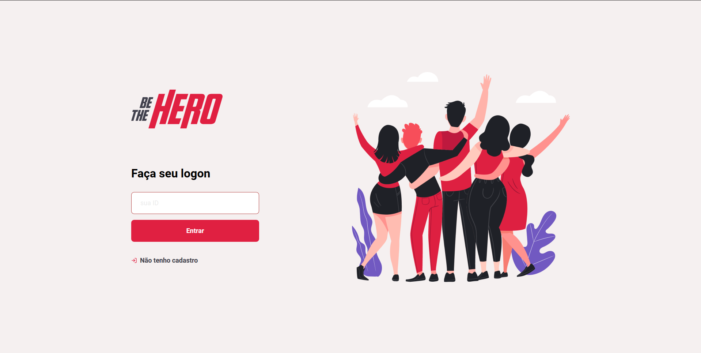
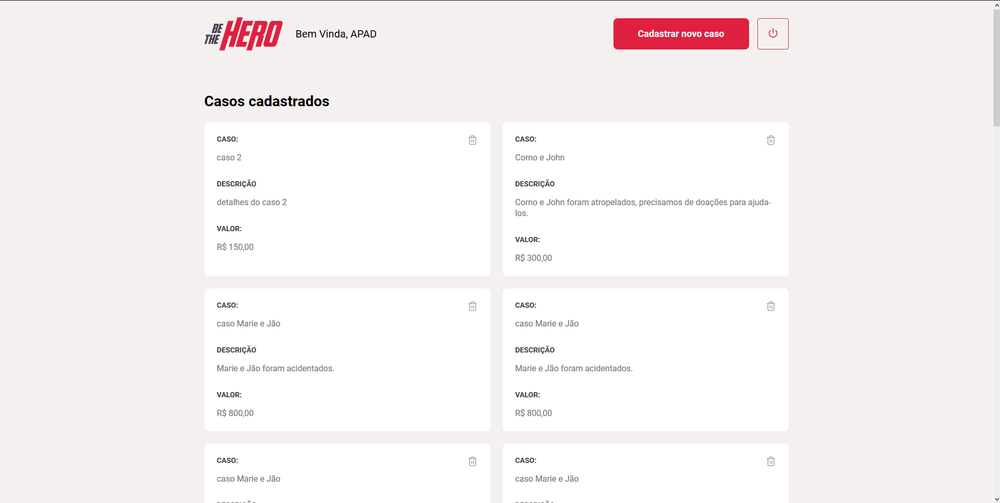
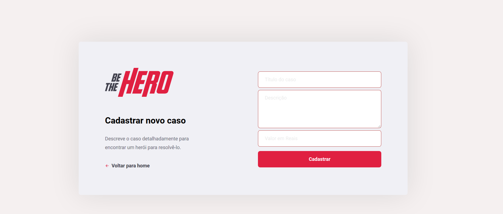
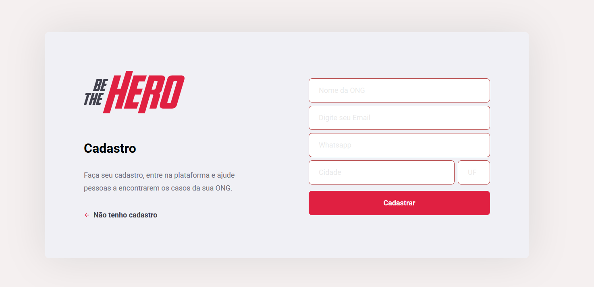
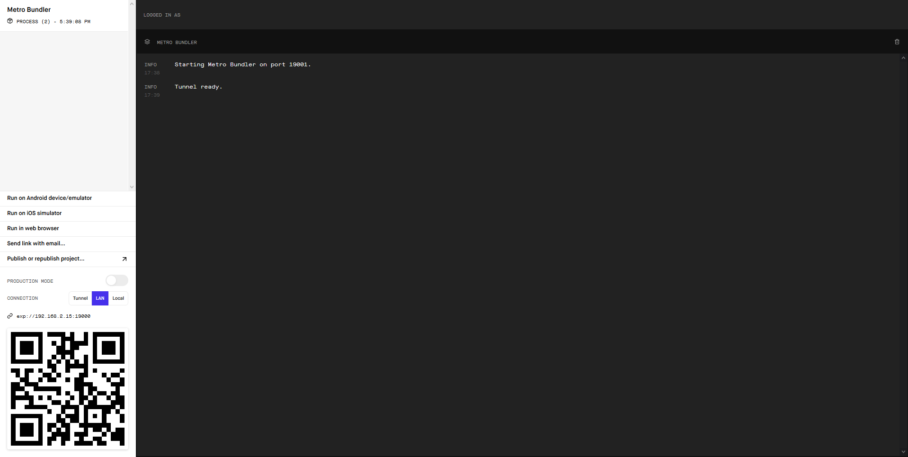
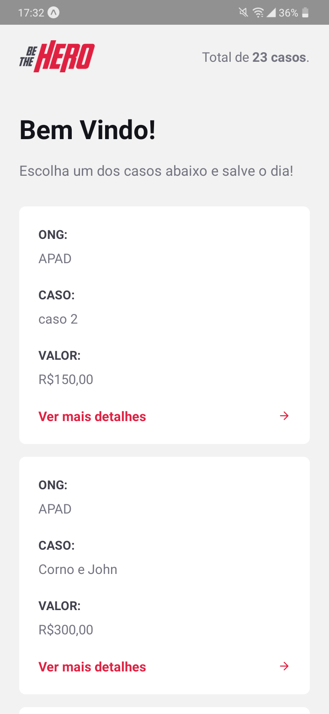
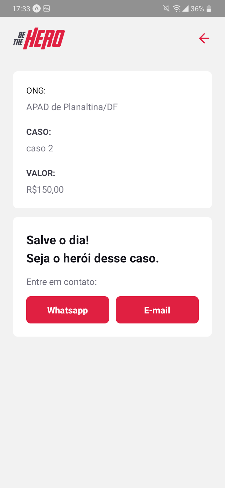
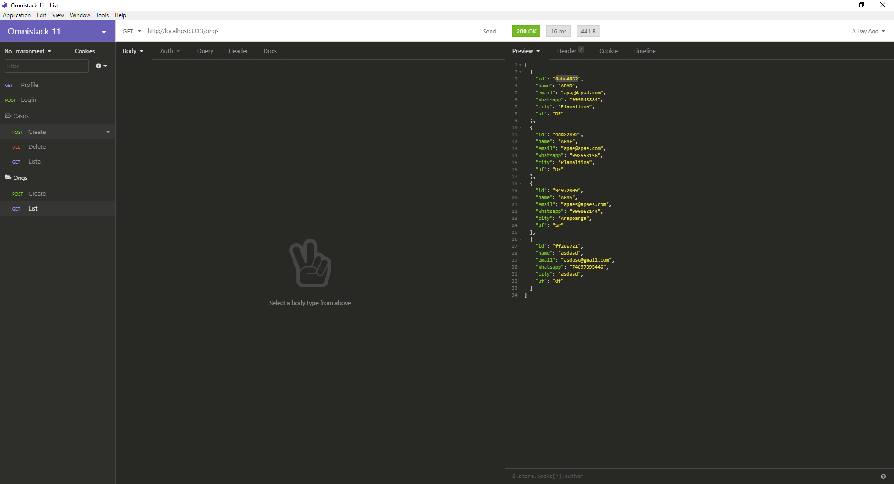

</img>

<h1 align="center">Semana Omnistack 11</h1>
<p align="center">Projeto <strong>Be The Hero</strong> da <strong>Rocketseat</strong></p>

# Sobre o projeto

O instrutor do projeto, como sempre, é o famoso <a href="https://github.com/diego3g">Diego</a>, a "cara" da Rocketseat.

Utilizamos diversas libs e frameworks, e pela primeira vez, foi usado um banco Relacional, o SQLite3.

Também implementamos alguns testes simples com o <a href="https://jestjs.io/">Jest</a>.

---

# Instalação

Nesse projeto foi usado o framework <a href="http://knexjs.org/">Knex.js</a>. Além disso, usamos o <a href="https://www.npmjs.com/package/sqlite3">SQLite3</a> como banco de dados.

E claro, estamos usando o <a href="https://nodejs.org/en/">Node.js</a>.

Baixe os arquivos do projeto, e dentro de cada pasta, digite :

```
npm install / yarn install
```

Esse comando irá instalar as dependências de cada projeto.

# API

Dentro da pasta **backend** digite em sua cmd:

```
npm start
```

Isso irá executar o servidor na porta **3333**

---

# Frontend

Entre na pasta **frontend** e digite em sua cmd:

```
npm start
```

Isso fará com que a aplicação <a href="https://reactjs.org/">React</a> abra no seu navegador.

</img>

**Página de login**

</img>

**Profile de cada ONG**

</img>

**Página de cadastro de casos**

</img>

**Página de cadastro de ONGS**

---

# Mobile

Usamos o <a href="https://expo.io/">Expo</a>.
Entre na pasta **mobile** e digite:

```
yarn start
```

Isso irá iniciar a aplicação <a href="https://reactnative.dev/">React Native</a> pela plataforma <a href="https://expo.io/">Expo</a>.

</img>

**Interface Expo**

Nessa interface, você encontra informações sobre a porta que o React Native está rodando, e informações sobre o projeto em si. Erros e resultados aparecem na aba Metro Bundler.

Instale o Expo no seu celular, disponível na App Store e Play Store, após isso, aponte um leitor QR Code para o QR Code disponível no canto inferior esquerdo, e o App irá abrir no seu celular, completamente funcional.

Também é possível rodar o Expo por um emulador IOS e Android. Para maiores informações, entre nas plataformas da **Rocketseat**.

</img>

**Listagem de todos os casos cadastrados**

</img>

**Página de contato com a ONG**

---

# Testando Métodos HTTP

Para fazer tais testes, utilizamos o <a href="https://insomnia.rest/">Insomnia</a>.

</img>

**Interface Insomnia**

Configurações usadas para os testes disponíveis no arquivo **insomnia_exports.json**. Basta importar essas configurações e usa-las.

---

# Considerações sobre A semana Omnistack 11

Fugindo um pouco do conteúdo desenvolvido, sempre que vou falar da **Rocketseat** pra alguém, falo do marketing genial da empresa.
Sou bombardeado com toneladas de propagandas de cursos e diversos serviços todos os dias. Mas NENHUMA empresa até hoje me chamou atenção como a Rocket. Isso porque a pessoa responsável pelo marketing (Não sei quem é o indivíduo) pensou na experiência de assistir não só as propagandas, como também a experiência de fazer a semana . As cores são bonitas, o Diego tem uma dicção agradável, e o conteúdo desenvolvido está de acordo com o mercado. Fora que tem uma comunidade preparada com diversos devs prontos para tirar dúvidas que você venha a ter durante o processo.

Enfim, padrão Rocketseat de sempre. Parabéns.
